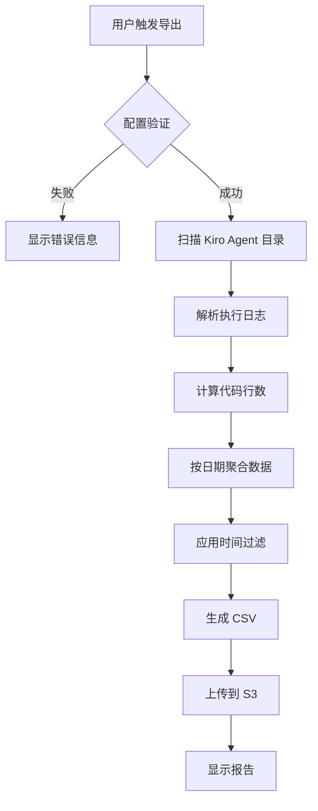
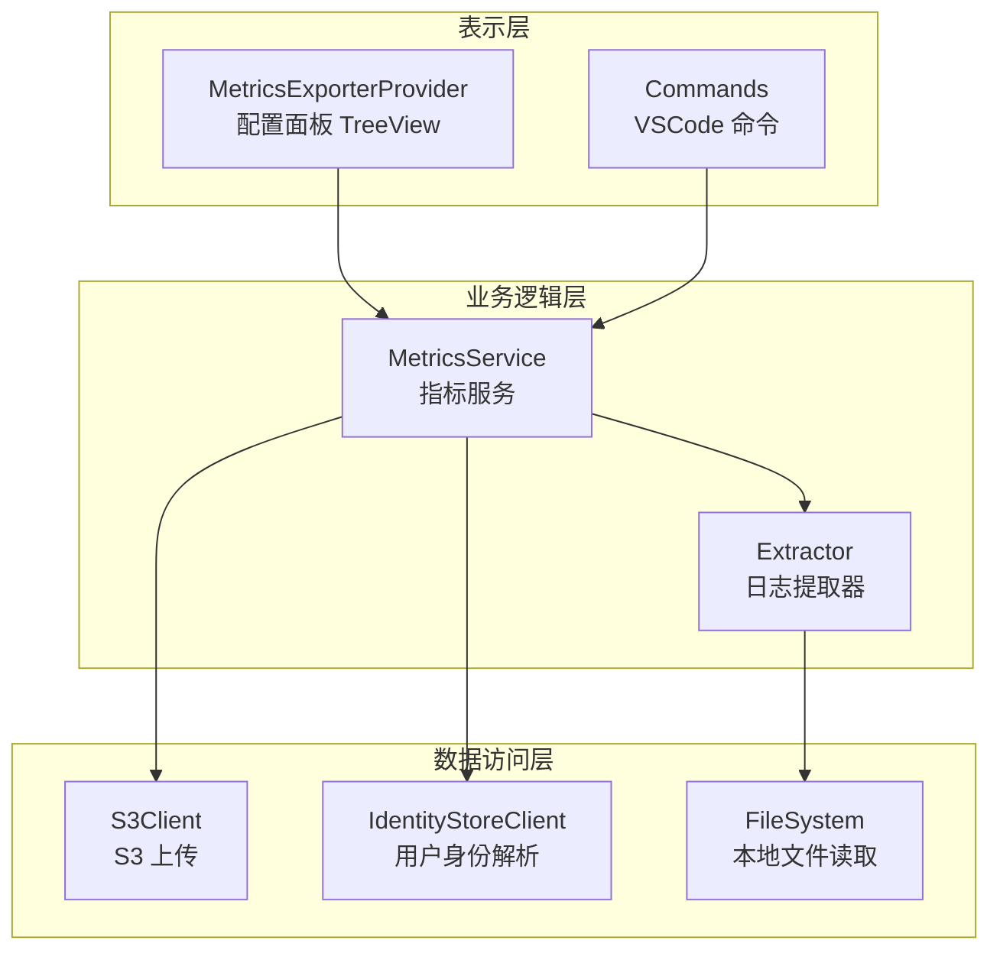

# Design Document: Kiro Metrics Exporter

## Overview

Kiro Metrics Exporter 是一个 VSCode 扩展，用于收集、处理和导出 Kiro IDE 的代码生成使用指标到 AWS S3。系统采用模块化架构，将配置管理、日志解析、数据聚合、CSV 生成和 S3 上传等功能分离到独立的组件中。

### 核心功能流程



## Architecture

系统采用分层架构，包含以下主要层次：



### 模块职责

| 模块 | 职责 |
|------|------|
| extension.ts | 扩展入口，注册命令和视图 |
| metricsExporterProvider.ts | 配置面板 TreeView 提供者，分四步骤组织配置项 |
| metricsService.ts | 核心业务逻辑，协调各组件，包含用户身份解析和 S3 权限检查 |
| extractor.ts | 日志解析和数据聚合 |
| logger.ts | 操作日志记录，按日期分文件存储 |
| types.ts | TypeScript 类型定义 |

## Components and Interfaces

### 1. MetricsExporterProvider

配置面板的 TreeView 数据提供者，实现 `vscode.TreeDataProvider<ConfigItem>` 接口。采用四步骤分组结构：

```typescript
interface MetricsExporterProvider {
    // 刷新树视图
    refresh(): void;
    
    // 获取树节点
    getTreeItem(element: ConfigItem): vscode.TreeItem;
    
    // 获取子节点 - 支持四级结构
    // Root: Version Info, Step 1, Step 2, Step 3, Step 4
    // Step 1: Access Key, Secret Key, Identity Store ID, Identity Store Region
    // Step 2: Username, Resolve Button, User ID, Display Name
    // Step 3: S3 Prefix, S3 Region, Check Permission Button
    // Step 4: Open Log File, Open Log Folder, Open Settings
    getChildren(element?: ConfigItem): Thenable<ConfigItem[]>;
}

class ConfigItem extends vscode.TreeItem {
    id: string;           // 配置项标识
    label: string;        // 显示标签
    command?: vscode.Command;  // 点击命令
}
```

### 2. MetricsService

核心服务类，负责协调配置管理、日志扫描、数据处理和 S3 上传。

```typescript
interface UserInfo {
    userId: string;
    displayName: string;
}

interface MetricsService {
    // 导出指标（全量）
    exportMetrics(): Promise<void>;
    
    // 带时间过滤的导出
    exportMetricsWithTimeFilter(filterType: 'lastWeek' | 'allTillYesterday'): Promise<void>;
    
    // 通过用户名获取 User ID 和 Display Name
    getUserInfoByUsername(username: string): Promise<UserInfo>;
    
    // 检查 S3 写入权限
    checkS3WritePermission(): Promise<void>;
    
    // 配置变更监听器（自动解析 Username）
    registerConfigurationListener(): void;
}
```

### 3. Extractor 模块

日志解析和数据聚合的核心模块，提供纯函数接口。

```typescript
// 日志扫描
function scanKiroAgentDirectory(basePath: string): ExecutionResult[];

// 单个日志处理
function processExecutionLog(filePath: string, seenExecutionIds: Set<string>): ExecutionResult | null;

// 行数计算
function countLines(text: string): number;
function calculateStrReplaceLines(oldStr: string, newStr: string): { added: number; deleted: number };

// 数据聚合
function aggregateByDate(results: ExecutionResult[]): Record<string, DailyStats>;
function aggregateByMonth(results: ExecutionResult[]): Record<string, MonthlyStats>;

// 导出
function exportToJson(results: ExecutionResult[]): MetricsExport;
function generateReport(results: ExecutionResult[]): string;
```

### 4. Logger 模块

操作日志记录模块，采用单例模式，按日期分文件存储日志。

```typescript
type LogLevel = 'INFO' | 'WARN' | 'ERROR';

class Logger {
    // 获取单例实例
    static getInstance(): Logger;
    
    // 记录日志
    log(level: LogLevel, context: string, message: string): void;
    info(context: string, message: string): void;
    warn(context: string, message: string): void;
    error(context: string, message: string): void;
    
    // 获取日志目录路径
    getLogDir(): string;
    
    // 获取当天日志文件路径
    getCurrentLogFile(): string;
}

// 导出单例
export const logger: Logger;
```

日志文件格式：
```
[2025-01-04T10:30:00.000Z] [INFO] [Upload Last 7 Days] ========== Operation Started ==========
[2025-01-04T10:30:00.001Z] [INFO] [Upload Last 7 Days] User: john.doe, UserId: xxx-xxx
[2025-01-04T10:30:00.002Z] [INFO] [Upload Last 7 Days] [Scanning] Started - Directory: /path/to/kiro.kiroagent
[2025-01-04T10:30:01.000Z] [INFO] [Upload Last 7 Days] [Scanning] Completed in 1.00s - Found 50 execution records
[2025-01-04T10:30:01.001Z] [INFO] [Upload Last 7 Days] [Upload] 1/7 - 2025-01-03 -> s3://bucket/path/file.csv
```

## Data Models

### UserInfo

用户身份信息：

```typescript
interface UserInfo {
    userId: string;      // AWS Identity Center User ID
    displayName: string; // 用户显示名称
}
```

### ExecutionResult

单次执行的处理结果：

```typescript
interface ExecutionResult {
    executionId: string;
    startTime: Date | null;
    endTime: Date | null;
    status: string;
    workflowType: string;
    fsWriteLines: number;
    strReplaceAdded: number;
    strReplaceDeleted: number;
    fileOperations: FileOperation[];
}
```

### FileOperation

文件操作记录：

```typescript
interface FileOperation {
    type: 'fsWrite' | 'strReplace';
    path: string;
    lines?: number;      // fsWrite 时的行数
    added?: number;      // strReplace 时的新增行数
    deleted?: number;    // strReplace 时的删除行数
}
```

### DailyStats / MonthlyStats

聚合统计数据：

```typescript
interface DailyStats {
    fsWriteLines: number;
    strReplaceAdded: number;
    strReplaceDeleted: number;
    executionCount: number;
    filesCreated: number;
    filesModified: number;
}

interface MonthlyStats extends DailyStats {
    netLines: number;
    activeDays: number;
}
```

### ExecutionLog

执行日志文件的 JSON 结构：

```typescript
interface ExecutionLog {
    executionId?: string;
    workflowType?: string;
    status?: string;
    startTime?: number;
    endTime?: number;
    metadata?: { endTime?: number };
    actions?: ExecutionAction[];
    context?: {
        messages?: Array<{
            entries?: Array<{
                type?: string;
                name?: string;
                id?: string;
                args?: Record<string, unknown>;
            }>;
        }>;
    };
}
```

### CSV 输出格式

CSV 文件包含以下列：

| 列名 | 数据来源 |
|------|----------|
| UserId | 配置的 AWS User ID |
| Date | MM-DD-YYYY 格式日期 |
| Chat_AICodeLines | Net_Lines 计算值 |
| Chat_MessagesSent | executionCount |
| 其他列 | 设为 0 |

### S3 路径结构

```
{s3Prefix}/{year}/{month}/{day}/00/kiro-ide-{userId}.csv
```

### 配置项结构（package.json）

配置项按步骤分组，使用 `order` 属性控制显示顺序：

```json
{
  "metricsExporter.aws.accessKey": { "order": 1, "description": "[Step 1]..." },
  "metricsExporter.aws.secretKey": { "order": 2, "description": "[Step 1]..." },
  "metricsExporter.aws.identityStoreId": { "order": 3, "description": "[Step 1]..." },
  "metricsExporter.aws.identityStoreRegion": { "order": 4, "description": "[Step 1]..." },
  "metricsExporter.aws.username": { "order": 5, "description": "[Step 2]...", "markdownDescription": "...click here to resolve..." },
  "metricsExporter.aws.userId": { "order": 6, "description": "[Step 2]..." },
  "metricsExporter.aws.displayName": { "order": 7, "description": "[Step 2]..." },
  "metricsExporter.aws.s3Prefix": { "order": 8, "description": "[Step 3]...", "markdownDescription": "...click here to check..." },
  "metricsExporter.aws.s3Region": { "order": 9, "description": "[Step 3]..." }
}
```

## Correctness Properties

*正确性属性是系统在所有有效执行中应该保持为真的特征或行为——本质上是关于系统应该做什么的形式化陈述。属性作为人类可读规范和机器可验证正确性保证之间的桥梁。*

### Property 1: S3 前缀验证

*对于任意* 输入字符串，如果字符串以 "s3://" 开头，则验证应该通过；否则验证应该失败。

**Validates: Requirements 1.5**

### Property 2: 敏感值掩码

*对于任意* 长度大于等于 4 的字符串，掩码后的显示应该是 "***" 加上最后 4 个字符；对于长度小于 4 的字符串，应该显示 "Not set" 或完整掩码。

**Validates: Requirements 1.12**

### Property 3: 执行 ID 去重

*对于任意* 包含重复 executionId 的执行日志集合，处理后的结果集合中每个 executionId 应该只出现一次。

**Validates: Requirements 2.4**

### Property 4: 工具使用 ID 去重

*对于任意* 包含重复 tool use ID 的日志，处理后每个 tool use ID 应该只被计算一次。

**Validates: Requirements 2.5**

### Property 5: 行数计算一致性

*对于任意* 非空文本字符串，countLines 函数返回的行数应该等于文本中换行符数量加 1（对于 trim 后非空的文本）。

**Validates: Requirements 3.1**

### Property 6: strReplace Diff 计算

*对于任意* 两个字符串 oldStr 和 newStr，calculateStrReplaceLines 返回的 added 和 deleted 值应该满足：
- added >= 0
- deleted >= 0
- 如果 oldStr === newStr，则 added === 0 且 deleted === 0

**Validates: Requirements 3.2, 3.3**

### Property 7: 净行数计算公式

*对于任意* ExecutionResult，其 netLines 应该等于 fsWriteLines + strReplaceAdded - strReplaceDeleted。

**Validates: Requirements 3.5**

### Property 8: 日期聚合完整性

*对于任意* ExecutionResult 集合，aggregateByDate 后所有日期的 executionCount 之和应该等于原始集合中有效（有 startTime）记录的数量。

**Validates: Requirements 4.1, 4.3**

### Property 9: 月份聚合完整性

*对于任意* ExecutionResult 集合，aggregateByMonth 后所有月份的 executionCount 之和应该等于原始集合中有效记录的数量。

**Validates: Requirements 4.2, 4.4**

### Property 10: 日期范围过滤

*对于任意* 日期数据集和日期范围 [startDate, endDate]，过滤后的结果应该只包含日期在范围内（包含边界）的数据。

**Validates: Requirements 5.1, 5.2, 5.3**

### Property 11: CSV 日期格式转换

*对于任意* YYYY-MM-DD 格式的日期字符串，formatDateForCSV 应该返回 MM-DD-YYYY 格式的字符串，且年、月、日的值保持不变。

**Validates: Requirements 6.2**

### Property 12: CSV 字段映射

*对于任意* DailyStats 数据，生成的 CSV 中 Chat_AICodeLines 应该等于 fsWriteLines + strReplaceAdded - strReplaceDeleted，Chat_MessagesSent 应该等于 executionCount。

**Validates: Requirements 6.3, 6.4**

### Property 13: S3 路径生成

*对于任意* 有效的日期（YYYY-MM-DD）、用户 ID 和 S3 前缀，generateS3Path 应该返回符合模式 `{prefix}/{year}/{month}/{day}/00/kiro-ide-{userId}.csv` 的路径。

**Validates: Requirements 7.1**

### Property 14: S3 上传幂等性

*对于任意* 相同的日期和用户 ID 组合，多次调用 generateS3Path 应该返回相同的路径。

**Validates: Requirements 7.6**

### Property 15: 配置验证完整性

*对于任意* 配置状态，initializeS3 应该在缺少任何必需配置项（accessKey, secretKey, s3Prefix, userId, identityStoreId）时返回 false。

**Validates: Requirements 9.1, 9.2, 9.3, 9.4, 9.5**

### Property 16: 用户身份解析完整性

*对于任意* 有效的用户名，getUserInfoByUsername 应该返回包含 userId 和 displayName 的 UserInfo 对象，两个字段都不为空。

**Validates: Requirements 8.1, 8.2, 8.3**

### Property 17: 解析失败时清空用户信息

*对于任意* 无效的用户名或解析失败的情况，系统应该清空已存储的 userId 和 displayName 配置值。

**Validates: Requirements 8.4, 8.8**

### Property 18: S3 权限检查结果一致性

*对于任意* S3 配置，checkS3WritePermission 应该：
- 成功时返回确认消息
- 权限不足时返回 AccessDenied 错误
- 存储桶不存在时返回 NoSuchBucket 错误
- 凭证无效时返回相应的凭证错误

**Validates: Requirements 11.2, 11.3, 11.4, 11.5, 11.6**

## Error Handling

### 配置错误

| 错误场景 | 处理方式 |
|----------|----------|
| AWS 凭证未配置 | 显示错误信息，中止导出 |
| S3 前缀格式无效 | 输入验证时提示错误 |
| User ID 未配置 | 显示错误信息，中止导出 |
| Identity Store ID 未配置 | 显示错误信息，中止导出 |

### 文件系统错误

| 错误场景 | 处理方式 |
|----------|----------|
| kiro.kiroagent 目录不存在 | 显示错误信息，中止导出 |
| 日志文件无法读取 | 跳过该文件，继续处理 |
| JSON 解析失败 | 跳过该文件，继续处理 |

### AWS API 错误

| 错误场景 | 处理方式 |
|----------|----------|
| S3 上传失败 | 显示错误信息，包含失败原因 |
| 用户名解析失败 | 显示错误信息，提示用户不存在 |
| 凭证无效 | 显示认证错误信息 |

### 数据错误

| 错误场景 | 处理方式 |
|----------|----------|
| 无有效执行记录 | 显示警告信息 |
| 过滤后无数据 | 显示警告信息，不执行上传 |

## Testing Strategy

### 单元测试

使用 Mocha + Chai 进行单元测试，重点覆盖：

1. **Extractor 模块**
   - countLines 函数的边界情况
   - calculateStrReplaceLines 的 diff 计算
   - processExecutionLog 的 JSON 解析
   - aggregateByDate/aggregateByMonth 的聚合逻辑

2. **MetricsService**
   - 日期范围计算
   - CSV 格式生成
   - S3 路径生成
   - 配置验证逻辑

### 属性测试

使用 fast-check 进行属性测试，每个属性测试运行至少 100 次迭代：

1. **数据处理属性**
   - 行数计算一致性
   - Diff 计算正确性
   - 聚合完整性

2. **格式转换属性**
   - 日期格式转换
   - S3 路径生成
   - CSV 字段映射

3. **业务规则属性**
   - 去重逻辑
   - 日期范围过滤
   - 配置验证

### 集成测试

1. **端到端流程测试**
   - 模拟完整的导出流程
   - 验证 CSV 输出格式
   - 验证 S3 路径结构

2. **AWS 集成测试**（需要真实凭证）
   - S3 上传功能
   - Identity Store 用户解析

### 测试配置

```typescript
// fast-check 配置
fc.configureGlobal({
    numRuns: 100,
    verbose: true
});
```

### 测试标注格式

每个属性测试必须包含以下注释：

```typescript
/**
 * Feature: kiro-metrics-exporter
 * Property N: [属性标题]
 * Validates: Requirements X.Y
 */
```
