# 📊 Kiro Metrics Exporter 全面技术分析

> 仓库：`liangyimingcom/kiro-metrics-exporter`
> 当前版本：**v1.3.1**（2026-05-19）
> 类型：VSCode / Kiro IDE 扩展
> 协议：MIT

---

## 一、产品定位与核心价值

**Kiro Metrics Exporter** 是一个 VSCode/Kiro IDE 扩展，作用是把本地 Kiro IDE 的 AI 代码生成使用数据（执行次数、新增/修改代码行数）按日聚合为 CSV，并按规范路径上传至 AWS S3，供企业侧分析平台消费。

### 一句话定位
> **把开发者本地的 Kiro AI 编码记录，自动同步到企业 S3 数仓里，做"AI 生产力"统计。**

### 关键设计取舍
| 维度 | 取舍 |
|---|---|
| 数据源 | 不接入 Kiro 后端 API，**直接读本地 `kiro.kiroagent` 目录下的 JSON 执行日志** |
| 数据通道 | 不用自建后端，**直接 S3 PutObject**（路径幂等，每天每用户一个文件） |
| 用户身份 | **AWS Identity Store**（GetUserId + DescribeUser）解析 username 为 userId |
| 触发方式 | 手动 + 定时（默认 8h 自动上传） |

---

## 二、需求模型（Requirements）

`requirements.md` 共定义了 **12 大需求 + 18 条正确性属性（Property）**，可归纳为五个领域：

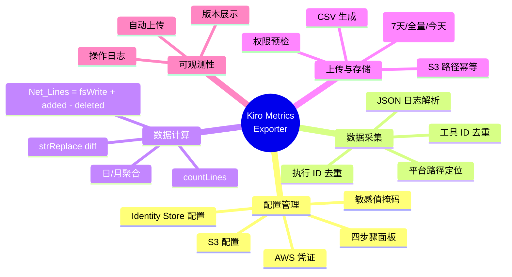

### 12 项核心需求摘要

| # | 需求 | 关键标的 |
|---|---|---|
| 1 | AWS 配置管理 | 4 步骤侧边栏面板，敏感值掩码，版本横幅 |
| 2 | 执行日志扫描与解析 | 跨平台路径，JSON 解析，executionId 去重 |
| 3 | 代码行数计算 | countLines、Diff、Net_Lines 公式 |
| 4 | 数据聚合 | 按日/按月聚合 |
| 5 | 时间过滤导出 | Today / Last 7 Days / All Till Yesterday |
| 6 | CSV 生成 | UserId, Date(MM-DD-YYYY), Chat_AICodeLines, Chat_MessagesSent |
| 7 | S3 上传 | 路径幂等：`{prefix}/{Y}/{M}/{D}/00/kiro-ide-{userId}.csv` |
| 8 | 用户身份解析 | GetUserId → DescribeUser → DisplayName |
| 9 | 配置验证 | 上传前必填项校验 |
| 10 | 报告生成 | 输出通道展示总体/月/日明细 |
| 11 | S3 权限检查 | 上传 → 删除 测试文件 |
| 12 | 操作日志记录 | `~/.kiro-metrics-exporter/logs/metrics-exporter-YYYY-MM-DD.log` |

---

## 三、系统架构（Design）

### 3.1 分层架构

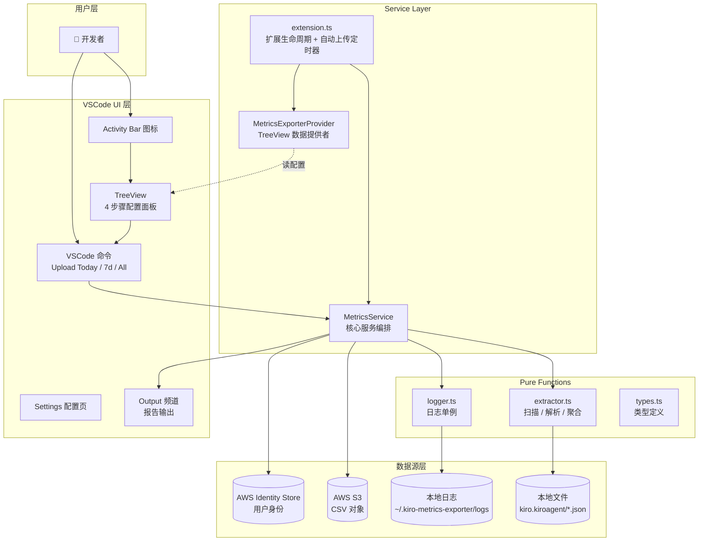

### 3.2 模块依赖图

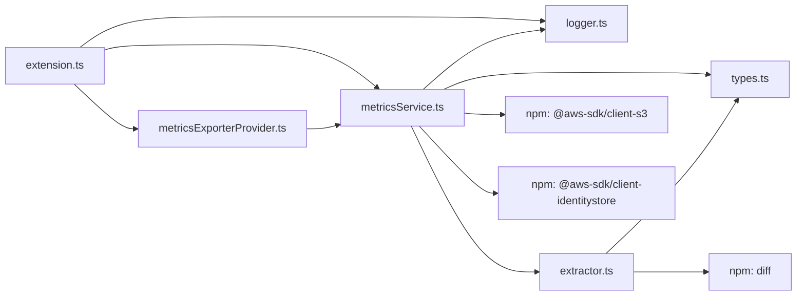

### 3.3 模块职责矩阵

| 模块 | 行数 | 职责 | 是否纯函数 |
|---|---|---|---|
| `extension.ts` | 126 | 激活/停用、自动上传定时器、配置变更监听 | ❌ 副作用 |
| `types.ts` | 120 | 全部 TypeScript 类型/接口定义 | ✅ 纯类型 |
| `extractor.ts` | 530 | 扫描目录、解析 JSON、行数计算、日/月聚合、生成报告 | ✅ 大部分纯函数 |
| `metricsService.ts` | 885 | 命令注册、AWS SDK 调用、CSV 生成、S3 上传、日期过滤 | ❌ 强副作用 |
| `metricsExporterProvider.ts` | 196 | TreeView 4 级数据提供 | 半纯（读配置） |
| `logger.ts` | 66 | 单例日志器，按日期分文件 | ❌ 文件副作用 |

---

## 四、关键工作流（端到端）

### 4.1 扩展激活流程

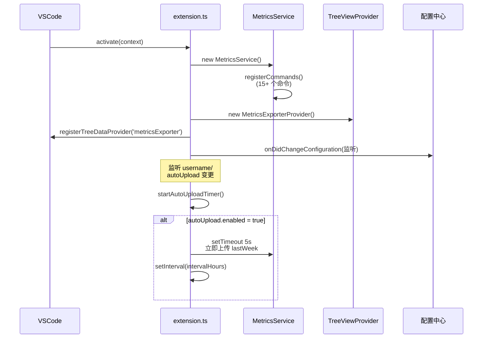

### 4.2 上传指标主流程（以 Upload Last 7 Days 为例）

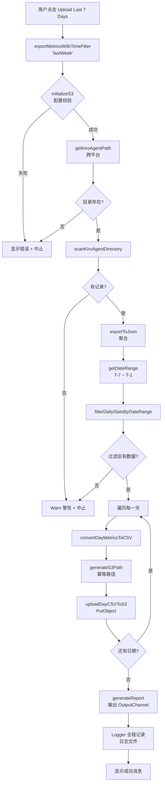

### 4.3 用户身份解析流程

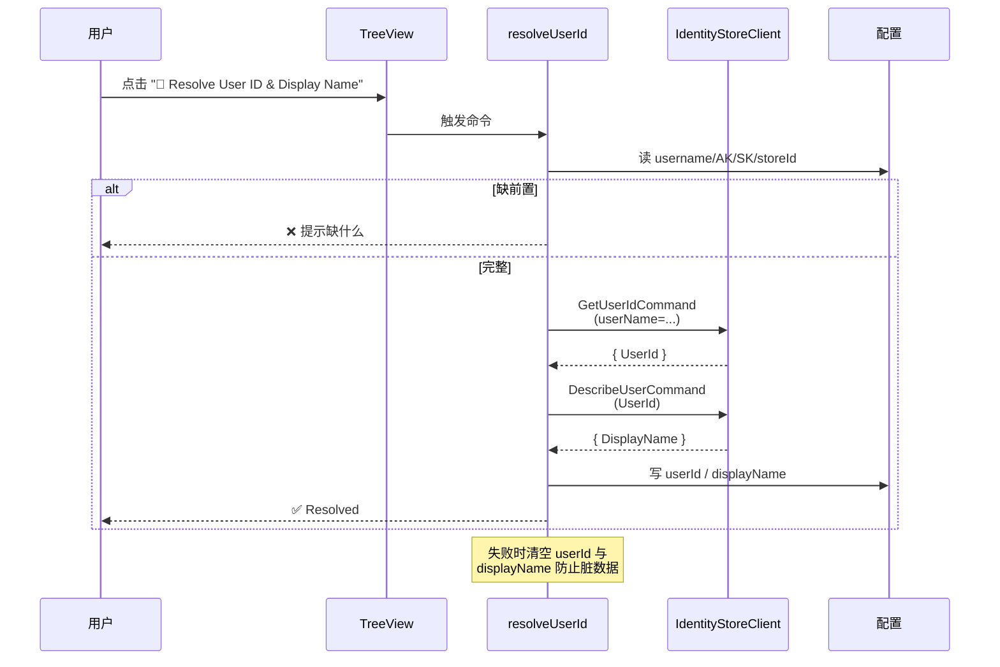

### 4.4 配置变更自动解析（防抖 500ms）

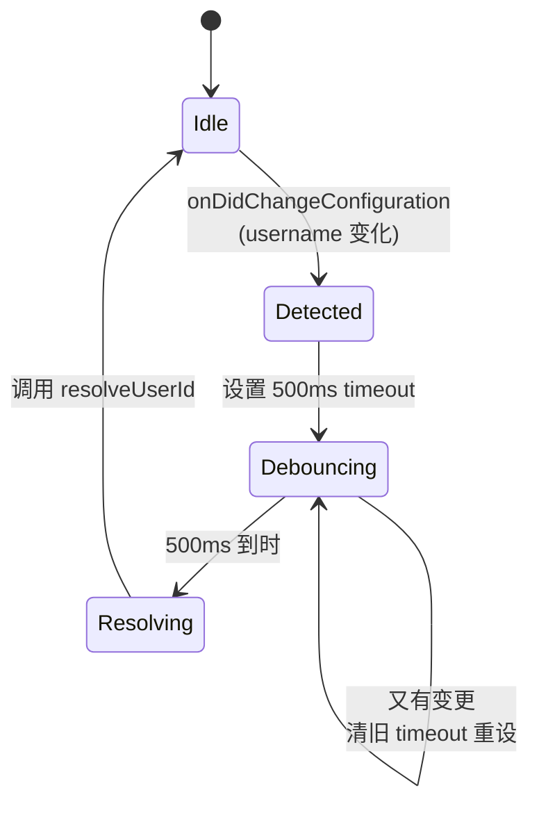

---

## 五、核心算法解析

### 5.1 行数计算公式（Net_Lines）

```
Net_Lines = fsWriteLines + strReplaceAdded - strReplaceDeleted
```

- **fsWrite**：新建文件 → 行数 = `text.trim().split('\n').length`
- **strReplace**：使用 `diff` 库的 `diffArrays` 逐行对比
  - `change.added` 累计 → `strReplaceAdded`
  - `change.removed` 累计 → `strReplaceDeleted`

### 5.2 工具名归一化（v1.3.1 核心修复）⭐

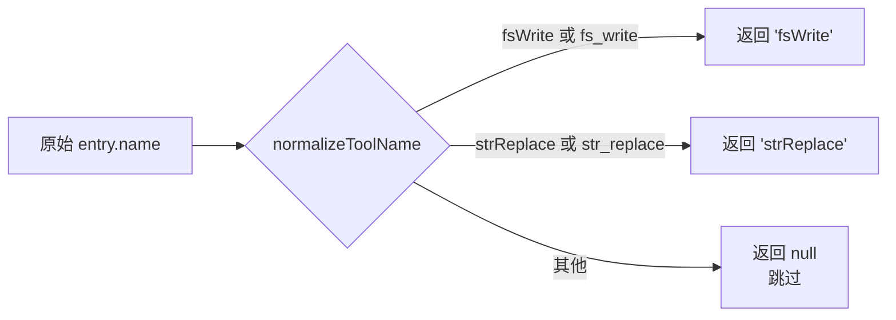

**这是 v1.3.1 的关键修复**：Kiro 在 2026-05-07 把日志里的工具名从 camelCase 改为 snake_case，旧版扩展会因为名称对不上而把统计数据降为 0。

### 5.3 双源 ToolUse 提取与去重

执行日志中存在两个数据来源：
- `data.actions[]` —— 结构化的动作数组
- `data.context.messages[].entries[]` —— 对话消息中的 toolUse 条目

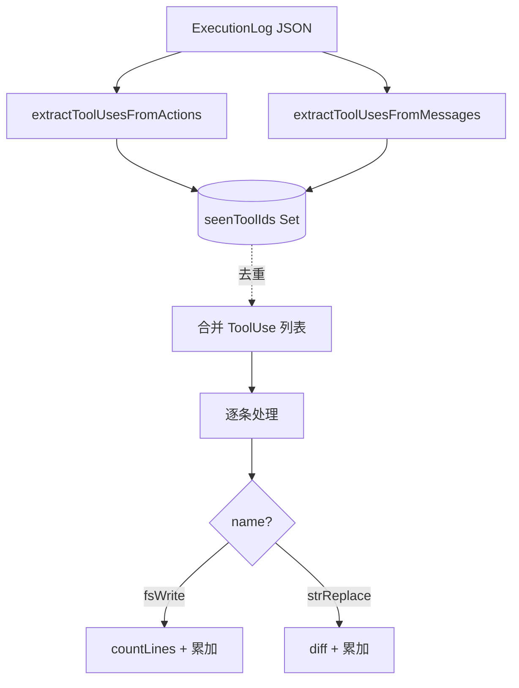

去重维度有两层：
1. **executionId 级**：跨文件去重（`seenExecutionIds`）
2. **toolUseId 级**：单 execution 内去重（`seenToolIds`）

### 5.4 S3 路径生成（幂等）

```
s3://{bucket}/{basePath}/{YYYY}/{MM}/{DD}/00/kiro-ide-{userId}.csv
```

**幂等性保证**：同一 (date, userId) 组合永远生成相同的 key，重复上传只会覆盖，不会产生重复记录。

### 5.5 时间过滤范围

| filterType | startDate | endDate |
|---|---|---|
| `today` | 今天 00:00:00 | 今天 23:59:59 |
| `lastWeek` | T-7 天 00:00:00 | 昨天 23:59:59 |
| `allTillYesterday` | 2020-01-01 00:00:00 | 昨天 23:59:59 |

---

## 六、模块实现详解

### 6.1 `types.ts` —— 数据契约

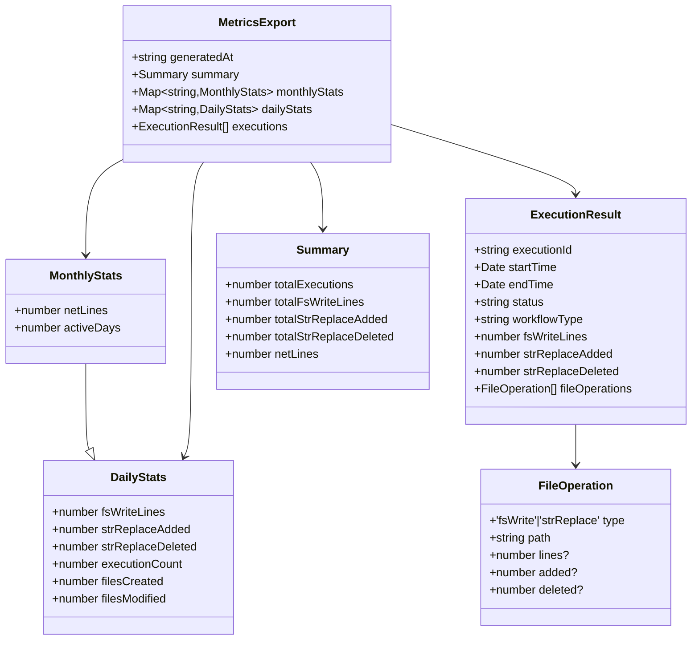

### 6.2 `extractor.ts` —— 数据计算引擎

| 函数 | 输入 | 输出 | 备注 |
|---|---|---|---|
| `countLines(text)` | string | number | 空 → 0；trim + split('\n') |
| `calculateStrReplaceLines(old, new)` | (string, string) | `{added, deleted}` | 用 `diff.diffArrays` |
| `normalizeToolName(name)` | string \| undefined | `'fsWrite' \| 'strReplace' \| null` | **v1.3.1 新增**，兼容大小写蛇形 |
| `processExecutionLog(path, seenIds)` | (路径, Set) | ExecutionResult \| null | 单文件处理，自带去重 |
| `scanKiroAgentDirectory(base)` | string | ExecutionResult[] | 扫描两级目录 |
| `aggregateByDate(results)` | ExecutionResult[] | Record<date, DailyStats> | 按本地日期分组 |
| `aggregateByMonth(results)` | ExecutionResult[] | Record<month, MonthlyStats> | 含 activeDays 集合 |
| `generateSummary(results)` | ExecutionResult[] | Summary | 总计 |
| `exportToJson(results)` | ExecutionResult[] | MetricsExport | 完整导出 |
| `generateReport(results)` | ExecutionResult[] | string | 文本报告 |

**目录结构假设**：

```
kiro.kiroagent/
└── {sessionHash}/
    └── 414d1636299d2b9e4ce7e17fb11f63e9/   ← 固定常量目录
        └── *.json                           ← 执行日志
```

> 注：`414d1636299d2b9e4ce7e17fb11f63e9` 是一个硬编码常量目录名，可能是 Kiro IDE 的固定子模块标识。

### 6.3 `metricsService.ts` —— 编排核心（885 行）

这是最大的模块，承担所有"脏活"。结构如下：

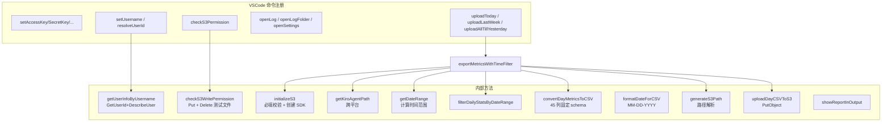

**CSV 字段映射**：CSV 输出固定 **45 列**（与企业 BI 兼容），但只有 3 列有真实值，其余全为 `0`：

| 列 | 含义 | 来源 |
|---|---|---|
| `UserId` | AWS Identity Center User ID | 配置 `aws.userId` |
| `Date` | MM-DD-YYYY | 由 YYYY-MM-DD 转换 |
| `Chat_AICodeLines` | **AI 净增代码行** | `fsWriteLines + strReplaceAdded - strReplaceDeleted` |
| `Chat_MessagesSent` | 执行次数 | `dailyStats.executionCount` |
| 其他 42 列 | InlineChat / CodeFix / TestGeneration ... | 全部 0 |

### 6.4 `metricsExporterProvider.ts` —— TreeView UI

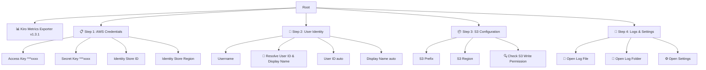

实现要点：
- 实现 `vscode.TreeDataProvider<ConfigItem>`
- 通过 `_onDidChangeTreeData` EventEmitter 触发刷新
- 敏感值掩码：`'***' + key.slice(-4)`
- 每个叶子节点绑定 `vscode.Command`，点击即触发命令

### 6.5 `logger.ts` —— 单例日志器

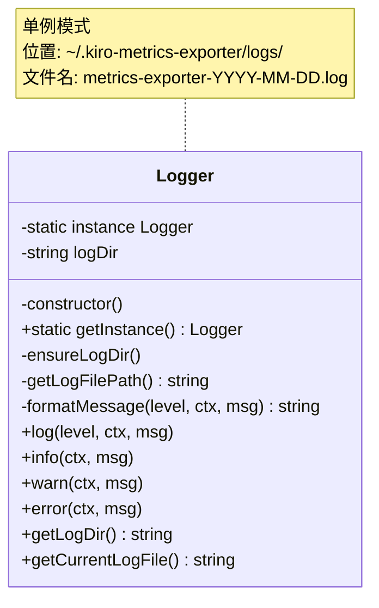

**日志格式**：
```
[ISO时间戳] [INFO|WARN|ERROR] [上下文] 消息内容
```

**典型日志片段**（v1.3.0 起内置）：
```
[2026-05-28T03:00:00.000Z] [INFO] [Upload Last 7 Days] ========== Operation Started ==========
[2026-05-28T03:00:00.001Z] [INFO] [Upload Last 7 Days] User: john.doe, UserId: xxx-xxx
[2026-05-28T03:00:00.500Z] [INFO] [Upload Last 7 Days] [Scanning] Completed in 0.50s - Found 50 execution records
[2026-05-28T03:00:01.000Z] [INFO] [Upload Last 7 Days] [Filter] Found 7 days of data to upload
[2026-05-28T03:00:02.000Z] [INFO] [Upload Last 7 Days] [Upload] 1/7 - 2026-05-21 -> s3://bucket/.../kiro-ide-xxx.csv
...
[2026-05-28T03:00:08.000Z] [INFO] [Upload Last 7 Days] Total Time: 8.00s (Scan: 0.50s, Upload: 7.50s)
```

### 6.6 `extension.ts` —— 自动上传调度器

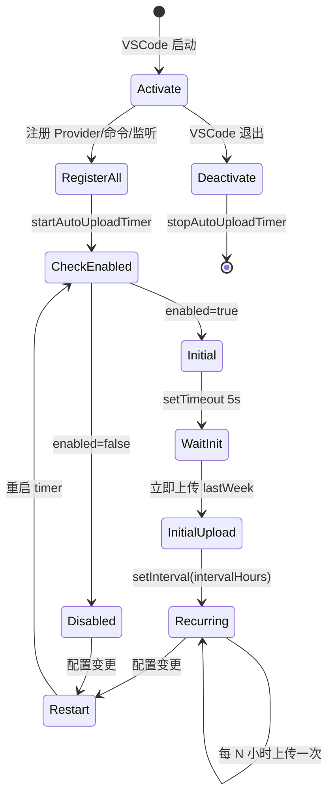

---

## 七、AWS 集成详解

### 7.1 IAM 权限矩阵

| 服务 | 权限 | 用途 |
|---|---|---|
| `s3:PutObject` | 必须 | 上传 CSV |
| `s3:DeleteObject` | 必须 | 权限检查后清理测试文件 |
| `identitystore:GetUserId` | 必须 | username → userId |
| `identitystore:DescribeUser` | 必须 | userId → displayName |

### 7.2 跨平台路径

```mermaid
flowchart LR
    P[os.platform&#40;&#41;] --> W{win32?}
    W -->|是| WP["%APPDATA%\\Kiro\\User\\<br/>globalStorage\\kiro.kiroagent"]
    W -->|否| D{darwin?}
    D -->|是| DP["~/Library/Application Support/<br/>Kiro/User/globalStorage/kiro.kiroagent"]
    D -->|否| L{linux?}
    L -->|是| LP["~/.config/Kiro/User/<br/>globalStorage/kiro.kiroagent"]
    L -->|否| ERR[抛错: Unsupported platform]
```

---

## 八、版本演进历史 ⏱️

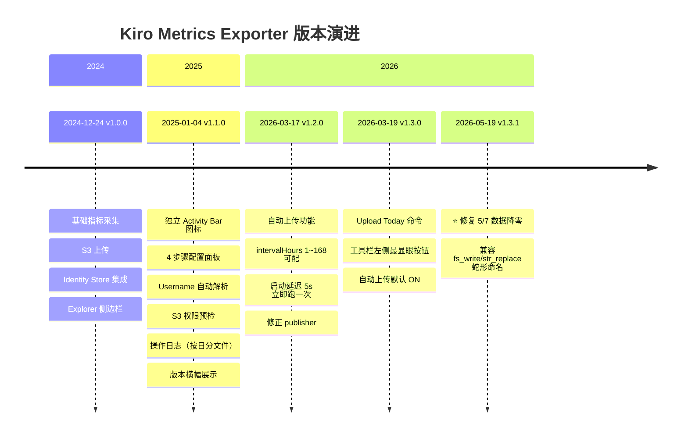

### 8.1 各版本核心变更对比

| 版本 | 类型 | 关键变更 | 影响面 |
|---|---|---|---|
| **1.0.0** | 🚀 初版 | 基础采集 + S3 上传 + 用户查找 | 全功能 |
| **1.1.0** | 🎨 UX 大改版 | Activity Bar、4 步配置、自动解析、权限检查、日志 | 全 UI + 可观测性 |
| **1.2.0** | ⏰ 自动化 | 自动上传 + 间隔配置 + publisher 修正 | 调度 |
| **1.3.0** | 🔘 易用性 | Upload Today 按钮 + 自动上传默认 ON | UX |
| **1.3.1** | 🐛 关键修复 | 兼容 Kiro 5/7 工具名变更 | 数据正确性 |

### 8.2 v1.3.1 关键修复深度剖析 ⭐

#### 问题现象
2026-05-07 之后，所有用户的统计数据**突然降为 0**。

#### 根因
Kiro IDE 在 5 月 7 日左右将其执行日志里的工具名从 **camelCase** 改成了 **snake_case**：

| 旧（≤ 5/6） | 新（≥ 5/7） |
|---|---|
| `fsWrite` | `fs_write` |
| `strReplace` | `str_replace` |

旧版扩展使用严格字符串匹配（`if (toolName === 'fsWrite')`），导致新格式的所有工具调用被丢弃。

#### 修复
新增工具名归一化函数 `normalizeToolName()`：

```typescript
function normalizeToolName(name: string | undefined): 'fsWrite' | 'strReplace' | null {
  if (!name) return null;
  if (name === 'fsWrite' || name === 'fs_write') return 'fsWrite';
  if (name === 'strReplace' || name === 'str_replace') return 'strReplace';
  return null;
}
```

#### 修复策略亮点
- **向后兼容**：保留 camelCase 处理旧日志
- **统一对内表示**：内部仍用 camelCase，避免代码大改
- **单点改造**：仅在 `extractToolUsesFromMessages` 入口处归一化，下游计算逻辑零改动

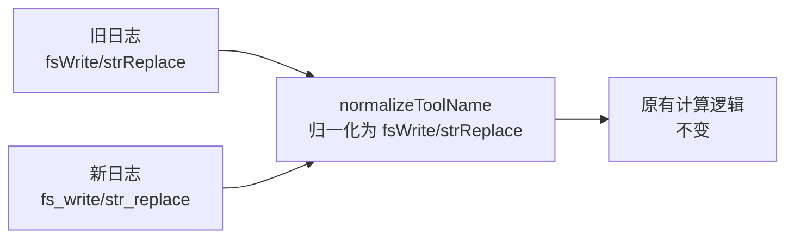

---

## 九、设计亮点与可改进点

### ✨ 亮点

1. **Spec-Driven 工程化** —— `.kiro/specs/` 中完整保留 requirements / design / tasks，连 18 条 Property 都有形式化描述
2. **路径幂等设计** —— 重复执行不产生脏数据
3. **可观测性强** —— 全程 Logger 记录，时间分段（Scanning/Filter/Upload），便于排查
4. **防御式 UI** —— 解析失败时主动清空 userId/displayName 防止脏数据残留
5. **跨平台抽象干净** —— `getKiroAgentPath()` 单点处理三平台
6. **配置驱动**——所有敏感值通过 VSCode Configuration API 管理，自带 sync 和加密能力

### ⚠️ 可改进点

1. **测试覆盖空缺** —— `tasks.md` 标注 `[x]` 的测试任务仅是规划，实际仓库无 `src/test/` 目录、无单测
2. **`exportMetrics` 旧方法** —— `metricsService.ts` 末尾仍保留无时间过滤的全量上传方法，但已无入口调用，可删
3. **`activate` 中 `console.log`** —— 与 Logger 不统一
4. **错误码识别用字符串匹配** —— `errorMsg.includes('AccessDenied')` 不如检查 `error.name === 'AccessDenied'` 稳定
5. **`414d1636299d2b9e4ce7e17fb11f63e9`** —— 魔法常量目录名应抽成命名常量并加注释
6. **CSV 列定义硬编码** —— 45 列写在数组字面量里，建议提到独立 schema 文件
7. **`@types/node` 25.x** —— 比 VSCode 1.103 实际运行时 Node 18 高很多，类型可能与 runtime 偏移

---

## 十、一图总览（架构 + 数据流）

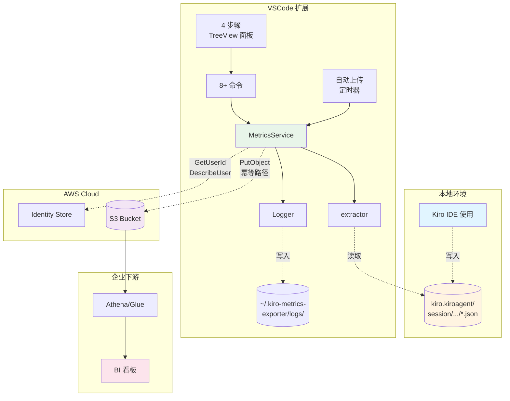

---

## 十一、总结

**Kiro Metrics Exporter** 是一个工程化非常好的小型 VSCode 扩展示范项目：

| 维度 | 评价 |
|---|---|
| 需求清晰度 | ⭐⭐⭐⭐⭐ 12 大需求 + 18 Property |
| 架构合理性 | ⭐⭐⭐⭐ 分层干净，纯函数与副作用分离良好 |
| 可观测性 | ⭐⭐⭐⭐⭐ Logger 全链路记录 |
| 可维护性 | ⭐⭐⭐⭐ 模块小、职责单一；测试缺失是唯一短板 |
| 容错与防御 | ⭐⭐⭐⭐⭐ 多层去重、配置校验、解析失败清空 |
| 文档完整度 | ⭐⭐⭐⭐⭐ README/CHANGELOG/specs/steering 齐备 |

**最新 v1.3.1 是一次教科书级的"上游协议变更"应急响应**：发现问题 → 单点归一化兼容 → 不破坏既有逻辑 → 一行注释清晰说明根因。整个修复在 `extractor.ts` 中只新增了 ~10 行代码，但拯救了所有用户从 5/7 之后的统计数据。
