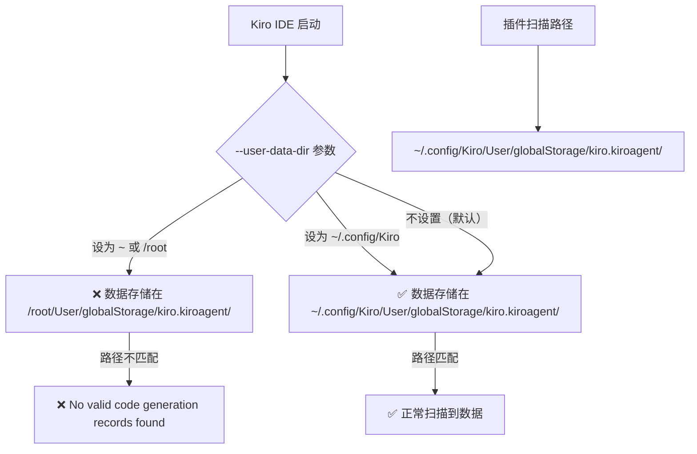
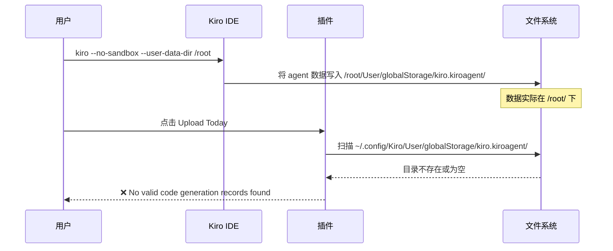
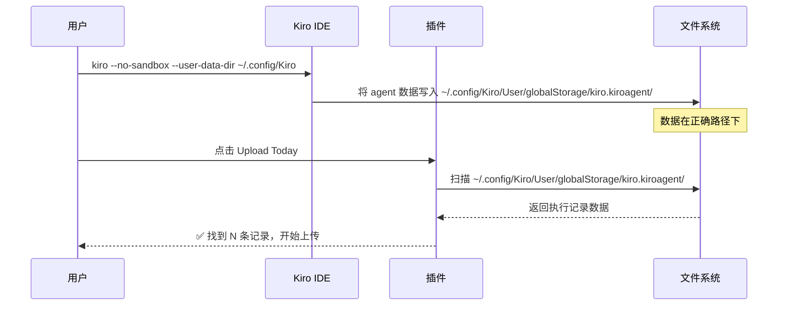

# 🐧 Linux/Ubuntu 环境下 Kiro Metrics Exporter 插件修复指南

> 适用环境：Ubuntu 22.04 / Debian / 其他 Linux 发行版  
> 适用场景：以 root 用户运行 Kiro IDE  
> 难度等级：L100（入门级，按步骤操作即可）  
> 最后更新：2026-05-28

---

## 📋 目录

- [问题描述](#问题描述)
- [问题原因分析](#问题原因分析)
- [解决方案](#解决方案)
- [详细操作步骤](#详细操作步骤)
- [验证修复成功](#验证修复成功)
- [常见问题 FAQ](#常见问题-faq)
- [附录：各平台数据路径对照表](#附录各平台数据路径对照表)

---

## 问题描述

### 现象

在 Linux/Ubuntu 系统上使用 Kiro IDE 时，安装 kiro-metrics-exporter 插件后，点击上传按钮时提示：

```
No valid code generation records found
```

即使你已经在 Kiro IDE 中进行了大量的代码编写和 AI 辅助生成操作。

### 影响

- 插件无法统计任何代码生成数据
- 所有上传操作均显示"无数据"
- 日志中反复出现 "No valid code generation records found"

---

## 问题原因分析

### 根本原因

Kiro IDE 在 Linux 上以 root 用户运行时，需要使用 `--no-sandbox` 参数。但如果同时错误设置了 `--user-data-dir` 参数，会导致 Kiro 的数据存储路径与插件的默认扫描路径不匹配。

### 路径匹配关系



### 问题发生的流程



### 修复后的正确流程



---

## 解决方案

### 一句话总结

启动 Kiro IDE 时，将 `--user-data-dir` 设置为 `~/.config/Kiro`：

```bash
kiro --no-sandbox --user-data-dir ~/.config/Kiro
```

### 错误 vs 正确启动方式对比

| 启动命令 | 结果 |
|---------|------|
| ❌ `kiro --no-sandbox --user-data-dir /root` | 插件无法找到数据 |
| ❌ `kiro --no-sandbox --user-data-dir ~` | 插件无法找到数据 |
| ❌ `kiro --no-sandbox` （不指定 user-data-dir） | 可能有效，取决于系统默认配置 |
| ✅ `kiro --no-sandbox --user-data-dir ~/.config/Kiro` | **正确！插件正常工作** |

---

## 详细操作步骤

### 步骤 1：关闭当前的 Kiro IDE

```bash
# 如果从终端启动的，按 Ctrl+C 关闭
# 或通过 Kiro IDE 菜单 File -> Exit
```

### 步骤 2：确认旧数据位置（可选）

检查是否有旧数据存在于错误路径：

```bash
# 检查错误路径是否有数据
ls -la /root/User/globalStorage/kiro.kiroagent/ 2>/dev/null

# 检查正确路径
ls -la ~/.config/Kiro/User/globalStorage/kiro.kiroagent/ 2>/dev/null
```

### 步骤 3：迁移旧数据（如需要）

如果在错误路径下有数据，可以迁移到正确位置：

```bash
# 创建正确的目录结构
mkdir -p ~/.config/Kiro/User/globalStorage/

# 如果旧路径有数据，复制过去
if [ -d "/root/User/globalStorage/kiro.kiroagent" ]; then
    cp -r /root/User/globalStorage/kiro.kiroagent ~/.config/Kiro/User/globalStorage/
    echo "数据迁移完成"
else
    echo "旧路径无数据，无需迁移"
fi
```

### 步骤 4：使用正确参数启动 Kiro IDE

```bash
kiro --no-sandbox --user-data-dir ~/.config/Kiro
```

### 步骤 5：创建桌面快捷方式或 alias（推荐）

为避免每次手动输入参数，创建一个 alias：

```bash
# 添加到 ~/.bashrc 或 ~/.zshrc
echo 'alias kiro="kiro --no-sandbox --user-data-dir ~/.config/Kiro"' >> ~/.bashrc
source ~/.bashrc
```

或创建桌面快捷方式 `.desktop` 文件：

```bash
cat > ~/.local/share/applications/kiro.desktop << 'EOF'
[Desktop Entry]
Name=Kiro IDE
Exec=kiro --no-sandbox --user-data-dir %h/.config/Kiro
Type=Application
Icon=kiro
Categories=Development;IDE;
Comment=Kiro IDE with correct data directory
EOF
```

---

## 验证修复成功

### 方法 1：通过插件界面验证

1. 打开 Kiro IDE（使用正确参数）
2. 在 Activity Bar 中点击 📊 图标打开 Metrics Exporter 面板
3. 点击 **⏱️ Upload Last 7 Days** 按钮
4. 观察输出：
   - ✅ 成功：显示 "Found X records" 或开始上传流程
   - ❌ 失败：仍然显示 "No valid code generation records found"

### 方法 2：通过文件系统验证

```bash
# 检查正确路径下是否有 agent 数据
ls ~/.config/Kiro/User/globalStorage/kiro.kiroagent/

# 应该能看到类似以下文件/目录：
# conversations/  settings.json  等
```

### 方法 3：通过日志验证

```bash
# 查看最新日志
cat ~/.kiro-metrics-exporter/logs/metrics-exporter-$(date +%Y-%m-%d).log

# 成功时日志应包含类似：
# [INFO] [Scanning] Completed in X.XXs - Found N records
```

---

## 常见问题 FAQ

### Q1: 为什么 macOS 不需要这个操作？

macOS 上 Kiro IDE 的默认数据路径是 `~/Library/Application Support/Kiro/`，与插件的扫描路径一致，不需要额外配置 `--user-data-dir`。

### Q2: 我不是 root 用户，还需要 `--no-sandbox` 吗？

非 root 用户通常不需要 `--no-sandbox`。如果你是普通用户，直接运行 `kiro` 即可。只有 root 用户才需要 `--no-sandbox` 参数。

### Q3: 迁移数据后，旧路径的数据可以删除吗？

确认新路径数据正常、插件能正常扫描后，可以安全删除旧路径数据：

```bash
rm -rf /root/User/globalStorage/kiro.kiroagent/
```

### Q4: 升级 Kiro IDE 后会不会覆盖这个设置？

不会。`--user-data-dir` 是启动参数，只要你的 alias 或 `.desktop` 文件保持不变，升级不会影响。

### Q5: 我使用的是 WSL (Windows Subsystem for Linux)，适用吗？

适用。WSL 环境下 Kiro 的行为与原生 Linux 一致，同样需要正确设置 `--user-data-dir`。

### Q6: Docker 容器中运行 Kiro 怎么办？

Docker 容器中通常以 root 运行，同样需要：

```bash
kiro --no-sandbox --user-data-dir ~/.config/Kiro
```

建议在 Dockerfile 或 entrypoint 脚本中设置好。

---

## 附录：各平台数据路径对照表

| 平台 | Kiro Agent 数据路径 | 说明 |
|------|-------------------|------|
| Windows | `%APPDATA%\Kiro\User\globalStorage\kiro.kiroagent` | 通常为 `C:\Users\<用户名>\AppData\Roaming\Kiro\...` |
| macOS | `~/Library/Application Support/Kiro/User/globalStorage/kiro.kiroagent` | 标准 macOS 应用数据路径 |
| Linux | `~/.config/Kiro/User/globalStorage/kiro.kiroagent` | 遵循 XDG Base Directory 规范 |

### 路径验证命令

```bash
# Windows (PowerShell)
Test-Path "$env:APPDATA\Kiro\User\globalStorage\kiro.kiroagent"

# macOS
ls ~/Library/Application\ Support/Kiro/User/globalStorage/kiro.kiroagent/

# Linux
ls ~/.config/Kiro/User/globalStorage/kiro.kiroagent/
```

---

## 致谢

本修复方案由社区用户在 Ubuntu 22.04 + root 用户环境下发现并验证。感谢社区贡献！

---

## 相关链接

- [Kiro Metrics Exporter 主页](https://github.com/liangyimingcom/kiro-metrics-exporter)
- [插件安装指南](../../README.md)
- [CHANGELOG](../../CHANGELOG.md)
